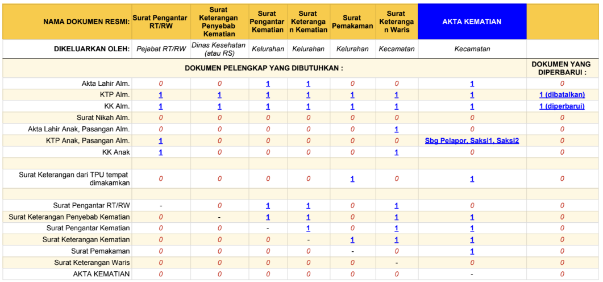

# Our parents will die - Well..we all will

I'll share here what administrative task to conduct or prepare when the time come.

From this point below, it will be in Bahasa Indonesia

_In loving memoriam_
 
_Ibu Irma Ansori Surapati_
 
_8 November 1944 - 11 September 2017_

/@ialexs 27 Sept 2017

## Latar Belakang

Kalau orang wafat, terputus semua urusan ybs dengan dunia, kecuali tiga hal (Google it yourself)   Tapi urusan dunia vs dunia lainnya harus diputuskan secara manual.

Berikut info yang setidaknya akan memberi gambaran terkait hal _administratif kependudukan_ jika ada yang meninggal dunia.

Apa yang harus dicapai, dipersiapkan dlsb.

> Catatan, saya dan orang tua saya berdomisili di DKI Jakarta.

Dalam keadaan keluarga berduka, *_harus_* ada yang bertanggung jawab mengurus semua hal-hal terkait administrasi kependudukan.

Akan sangat membantu jika seluruh syarat administratif dapat dengan mudah ditemukan.

--- 

### I. MULAI SEKARANG SCAN SEMUA DOKUMEN KEPENDUDUKAN

> (beruntung, hal ini sudah saya lakukan bertahap dari tahun lalu)

Mulai sekarang, dokumentasikan dengan sistematis dan rapih seluruh dokumen-dokumen milik **_Orang Tua_** dan **_seluruh Saudara Kandung_** kalian.

Check list dokumen kependudukan utama:

- Akta Kelahiran
- KTP/Kartu Tanda Penduduk
- KK/Kartu Keluarga
- Akta Nikah

> Kalau KTP hilang,
> nama tidak tercantum di Kartu Keluarga,
> Akta Kelahiran dimakan kucing dlsb..
>
> **SEGERA** URUS SEKARANG JUGA.
>
> Jangan sampai dalam keadaan berduka akan disibukan
> dengan urusan dokumen-dokumen tersebut.

Jangan hanya photo dengan smartphone.

Scan semua dokumen tersebut menjadi PDF, dengan DPI >= 300.
 Simpan di tempat aman. Dropbox, GoogleDrive atau yang lain

> [Best practices for file naming - Stanford Library](https://library.stanford.edu/research/data-management-services/data-best-practices/best-practices-file-naming)

Bayangkan, kalau orang tua tinggal di lain kota dan kakak-beradik berjumlah banyak, juga berdomisili di berbagai kota.

**Mulai dari sekarang dokumentasikan empat dokumen kependudukan utama tersebut.**

### II. GOAL

Goal adalah mendapatkan dokumen resmi kependudukan bernama: **Akta Kematian**
 
Berikut check list:

- <a href="https://docs.google.com/spreadsheets/d/1LN7RlhlJd6b7IdraDc-XHPCiSptVUhtkdcoPiY107yQ/edit?usp=sharing">Google Sheet</a>
- <a href="https://drive.google.com/file/d/0B5eyVPARjEniYnl2Tl9rUUgxdTA/view?usp=sharing">PDF</a>

### III. Jadi AKAMSI

Jadi Akamsi.. alias  Anak Kampung Sini. Kenal, atau setidaknya wajib tahu nama/alamat dari:

- **Lokasi Puskesmas**

> Jika wafat di rumah (bukan di Rumah Sakit), kita perlu memanggil Dokter Petugas Puskesmas untuk datang dan melakukan VeR (visum et repertum) jenazah.
>
> Penyebab kematian secara medis akan dicantumkan pada salah satu dokumen resmi: **Surat Keterangan Penyebab Kematian**

- **Pejabat RT/RW**

> Sebelum naik ke Kelurahan atau Kecamatan, semua surat resmi kependudukan akan membutuhkan Surat Pengantar dari Pejabat RT/RW
>
> Catatan: Pejabat RT/RW adalah _bukan_ PNS.
> Mereka adalah warga-sipil yang dipilih oleh warga setempat.

- **Lokasi Kantor Kelurahan dan Kecamatan**

Kantor Kelurahan dan Kantor Kecamatan DKI sekarang menggunakan nomor queueing seperti di Bank. Petunjuk prosedur pengurusan seluruh dokumen sudah jelas dengan petugas pelayanan yang profesional.

### IV. Good luck

Start documenting & scanning your document!

---
/<a href="https://twitter.com/ialexs">@ialexs</a>
/Sat Sep 30 14:13:14 WIB 2017
